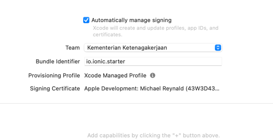
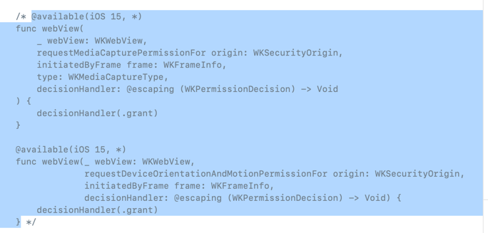

# Ionic x Verihubs

### Installation
1. Clone this repository
2. run `npm install`

### Serve to Browser
1. run `ionic serve`
2. This command will open your default browser and run the app

### Platform Preparation
1. run `ionic cap add android`
2. run `ionic cap add ios`
3. run `ionic cap sync --configuration=staging`

### Run to Android
Prepare your android studio first (include java etc)
1. run `ionic cap open android`
2. This command will open android studio
3. After android studio open you can just run the application to your connected android device

### Run to iOS
Prepare your xcode first
1. run `ionic cap open ios`
2. This command will open xcode
3. After xcode open you can just run the application to your connected iOS device

### iOS Quirks
in Pods/Development Pods/Capacitor/WebViewDelegationHandler.swift

Comment this handler: WebViewDelegationHandler line 50 until 67

Signing please use your own Apple development team

**run step above sequentially**
